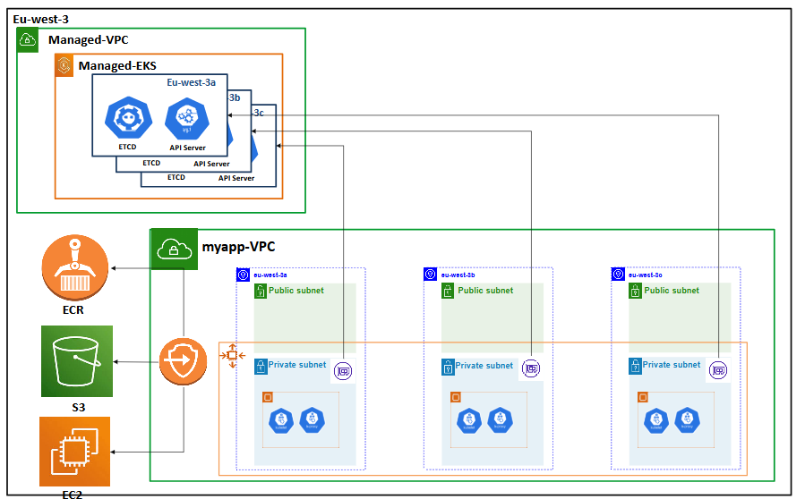
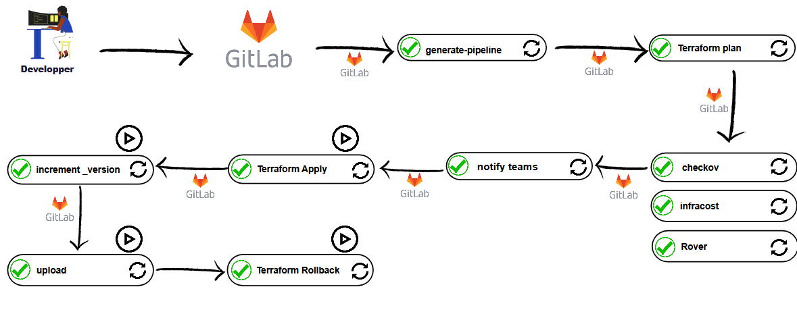
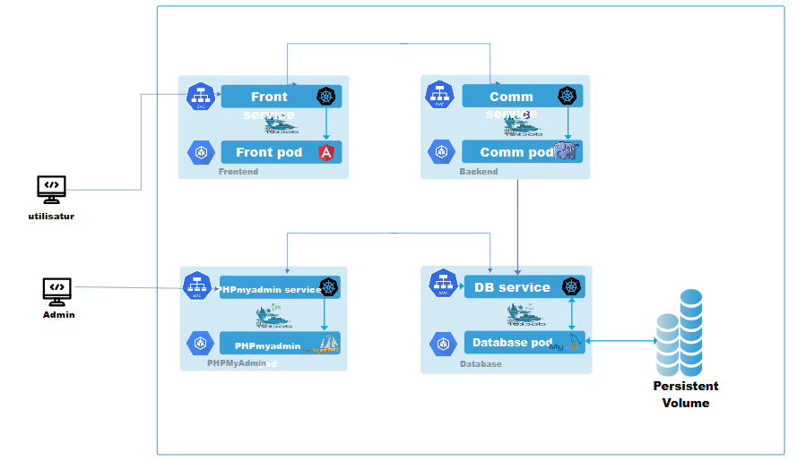
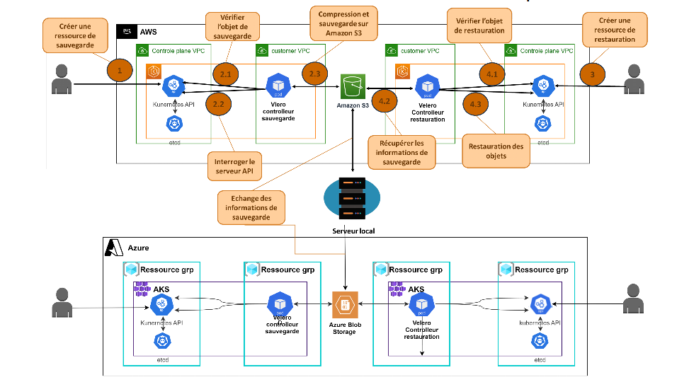

# ☁️ DevOps Cloud Migration Internship Project

**Migration of a DevOps Solution to the Cloud**  
📍 Final Year Engineering Internship | ENIS | 2023  
🛠️ Implemented by: [Ghassen Khalfallah](https://www.linkedin.com/in/ghassenkhalfallah)

---

## 📌 Project Overview

This project focused on migrating an on-premise DevOps workflow to a **cloud-native, containerized infrastructure** using **AWS, GitLab CI/CD, Terraform, and Kubernetes**.

The legacy solution had limitations in:
- Security
- Tool fragmentation
- Lack of automation
- No backup/recovery solution

My goal was to deliver a **scalable, secure, and fully automated cloud infrastructure**, supporting CI/CD and native backup, following DevOps best practices.

---

## 🚀 Delivered Features (Agile / 4 Sprints)

### 🔹 Sprint 1 – Cloud Infrastructure with IaC
- Provisioned secure and scalable infrastructure on AWS
- Used Terraform for Infrastructure as Code (IaC)
- Managed VPC, EC2, S3, IAM

📸 **AWS architecture diagram**: 

---

### 🔹 Sprint 2 – IaC Automation with GitLab CI/CD
- Created GitLab workspaces and repositories
- Automated version control and deployment of infrastructure
- Integrated GitLab CI with Terraform for IaC changes
📸 **GitLab workspaces + IaC flow**: 

---

### 🔹 Sprint 3 – Application Deployment via CI/CD
- Containerized and deployed a modular HR portal using Docker & Kubernetes
- Deployed services: frontend, backend, database, PHPMyAdmin
- Implemented CI/CD pipeline from GitLab to Kubernetes (EKS)

📸 **Kubernetes pods and services architecture**:

---

### 🔹 Sprint 4 – Cloud-Native Backup & Recovery with Velero
- Implemented a secure, automated backup solution using **Velero** and **Amazon S3**
- Covered full disaster recovery lifecycle: snapshotting, compression, storage, and restore workflows
- Ensured reliable recovery of Kubernetes workloads in case of infrastructure failure

📸 **Backup & restore lifecycle flow**:

---

## 🧰 Tech Stack

| Category       | Tools                             |
|----------------|------------------------------------|
| IaC            | Terraform                          |
| CI/CD          | GitLab CI/CD                       |
| Containers     | Docker                             |
| Orchestration  | Kubernetes (EKS)                   |
| Cloud          | AWS (EC2, VPC, S3, ECR, IAM)       |
| Backup         | **Velero + S3**                    |
| Monitoring     | *(Planned: Prometheus, Grafana)*   |
| Languages      | Bash, HCL (Terraform), YAML        |

---

## 📁 Project Architecture

The architecture follows a **modular DevOps structure** with:
- Isolated infrastructure modules (VPC, EKS, EC2)
- Automated provisioning with Terraform
- Microservices deployed on Kubernetes
- CI/CD workflows for deployment + testing
- Integrated backup/recovery workflows

---

## 💡 Lessons & Impact

✅ Delivered a production-grade DevOps system with:
- Infrastructure automation (Terraform)
- CI/CD pipelines from code to deployment
- Secure, scalable cloud architecture on AWS
- Backup and disaster recovery system using Velero

✅ Tools and workflows are reusable for future projects

---

## 📬 Contact

- GitHub: [GassenKalfallah](https://github.com/GassenKalfallah)
- LinkedIn: [Ghassen Khalfallah](https://www.linkedin.com/in/ghassenkhalfallah)
